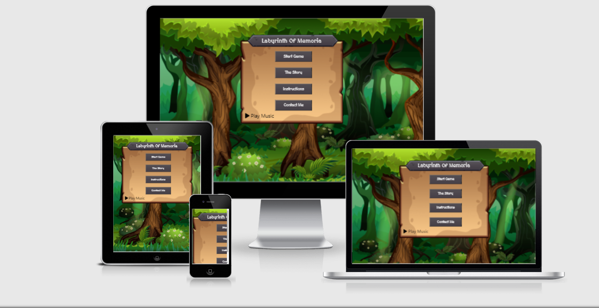

<h1 align="center">Labyrinth Of Memoria</h1> 
The scope for this project is to create a game using JavaScript and jQuery to demonstrate knowledge of DOM navigation.
  
Labyrinth Of Memoria is a Tile-based click adventure game where players need to navigate simple puzzles and collect letters to spell out the names of animals.
  

## User Experience (UX)

-   ### User stories

    -   #### First Time Visitor Goals

    -   #### Returning Visitor Goals

    -   #### Frequent User Goals

<h1>Design</h1>

## Strategy Plane

## Scope Plane

## Structure Plane

## Skeleton Plane

### Wireframes

-   #### Balsamiq - [View](https://github.com/KevAndrews/Milestone_Project_2/blob/main/Wireframes/MS2_Wireframes.bmpr)

-   #### Desktop
    1.  Menu View Wireframe - [View](https://github.com/KevAndrews/Milestone_Project_2/blob/main/Wireframes/desktop/Desktop%20Menu%20View.png)
    
    2.  Lore View Wireframe - [View](https://github.com/KevAndrews/Milestone_Project_2/blob/main/Wireframes/desktop/Desktop%20Lore%20View.png)
    
    3.  Instruction View Wireframe - [View](https://github.com/KevAndrews/Milestone_Project_2/blob/main/Wireframes/desktop/Desktop%20Instruction%20View.png)
    
    4.  Game View Wireframe - [View](https://github.com/KevAndrews/Milestone_Project_2/blob/main/Wireframes/desktop/Desktop%20Game%20View.png)

-   #### Tablet
    1.  Menu View Wireframe - [View](https://github.com/KevAndrews/Milestone_Project_2/blob/main/Wireframes/tablet/Tablet%20Menu%20View.png)
    
    2.  Lore View Wireframe - [View](https://github.com/KevAndrews/Milestone_Project_2/blob/main/Wireframes/tablet/Tablet%20Lore%20View.png)
    
    3.  Instruction View Wireframe - [View](https://github.com/KevAndrews/Milestone_Project_2/blob/main/Wireframes/tablet/Tablet%20Instruction%20View.png)
    
    4.  Game View Wireframe - [View](https://github.com/KevAndrews/Milestone_Project_2/blob/main/Wireframes/tablet/Tablet%20Game%20View.png)

-   #### Mobile

    1.  Menu View Wireframe - [View](https://github.com/KevAndrews/Milestone_Project_2/blob/main/Wireframes/mobile/Mobile%20Menu%20View.png)
    
    2.  Lore View Wireframe - [View](https://github.com/KevAndrews/Milestone_Project_2/blob/main/Wireframes/mobile/Mobile%20Lore%20View.png)
    
    3.  Instruction View Wireframe - [View](https://github.com/KevAndrews/Milestone_Project_2/blob/main/Wireframes/mobile/Mobile%20Instruction%20View.png)
    
    4.  Game View Wireframe - [View](https://github.com/KevAndrews/Milestone_Project_2/blob/main/Wireframes/mobile/Mobile%20Game%20View.png)

## Surface Plane

-   ### Design
    -   #### Colour Scheme

    -   #### Typography

    -   #### Imagery

## Features

-   Responsive on all device sizes from 768x1024px and up.

-   Toggle audio on and off.

-   Modals display menu information for ease of access.

-   Option to return to main menu at any point.

-   Click to move player.

## Technologies Used

### Languages Used

-   [HTML5](https://en.wikipedia.org/wiki/HTML5)
-   [CSS3](https://en.wikipedia.org/wiki/Cascading_Style_Sheets)
-   [JavaScript](https://en.wikipedia.org/wiki/JavaScript)

### Frameworks, Libraries & Programs Used

1. [Google Fonts:](https://fonts.google.com/)
    - Google fonts were used to import the 'MedievalSharp' and 'Oswald' font into the style.css file which is used on all pages throughout the project.
2. [Font Awesome:](https://fontawesome.com/)
    - Font Awesome was used on all pages throughout the website to add icons for the audio player.
3. [jQuery:](https://jquery.com/)
    - jQuery was used in the development of the maingame.js.
4. [Git](https://git-scm.com/)
    - Git was used for version control by utilizing the Gitpod terminal to commit to Git and Push to GitHub.
5. [GitHub:](https://github.com/)
    - GitHub is used to store the projects code after being pushed from Git.
6. [Balsamiq:](https://balsamiq.com/)
    - Balsamiq was used to create the [wireframes](https://github.com/KevAndrews/Milestone_Project_2/tree/main/Wireframes) during the design process.
7. [Tinypng](https://tinypng.com/) 
    -   was used to reduce the image file sizes.

## Testing
[You can find testing here!](https://github.com/KevAndrews/Milestone_Project_2/blob/main/TESTING.md)

### Bugs & Fixes
-   Audio would not play using shorten URL's, I found that you needed to use the full URL path to have the audio work correctly.
-   When you reloaded the game HTML you could no longer click to move, this was due to the Event listener been removed when you reloaded the game, to fix this I used the .on() event to re-add the click event to the div's.
-   When you moved from tile to tile you were able to move backwards when through the class was remove, this was fixed using the reload bug fix as the DOM was not being read correctly after updating the div class.

### Project changes from Wireframe to Development
-   From the original Wireframes there was no plan to add a contact page but I decided to add one to demo the use of an email API.
-   I wanted to design the game to be mobile friendly however due to outside issues I was unable to implement this part of the project, all my CSS is made to be as response as possible.
-   I wanted to add a simple player / enemy status screen in the game but ultimately decided against this as I felt it would not add must to the overall game.

### Known Issues

<h1>Deployment</h1>

## The project was deployed to GitHub Pages in the following way:
1.	By logging in to the [GitHub Repository](https://github.com/).
2.	Selecting the "Settings" Button in the menu at the top of the Repository.
3.	Scrolling down the Settings page to the "GitHub Pages" Section.
4.	Under "Source", clicking the dropdown menu labelled "None" and selecting "Master Branch".
5.	The page then refreshes itself.
6.	Scrolling back down the page to locate the [link to the published site](https://kevandrews.github.io/Milestone_Project_2/)  in "GitHub Pages".

## Forking the GitHub Repository
The GitHub Repository can be forked to make a copy of the original repository on the GitHub account to view and/or make changes without affecting the original repository in the following way.
1.	By logging in to GitHub and locating the [GitHub Repository](https://github.com/KevAndrews/Milestone_Project_2).
2.	Selecting the "Fork" button at the top of the Repository (it is located at the top right of the page under the profile image).
3.	There should then be a copy of the original repository in your GitHub account.

## Making a Local Clone
The GitHub Repository can be cloned in the following way:

1.	By logging in to GitHub and locating the [GitHub Repository](https://github.com/KevAndrews/Milestone_Project_2).
2.	Under the repository name, clicking the dropdown button marked “Code” and then selecting "Clone or download".
3.	Copying the link under "Clone with HTTPS", to clone the repository using HTTPS.
4.	Opening Git Bash.
5.	Changing the current working directory to the location where you want the cloned directory to be made.
6.	Typing git clone, and pasting the URL copied in Step 3.
7.	Pressing Enter to create the local clone.

<h1>Credits</h1>

1.	https://freefrontend.com/css-buttons/ - https://codepen.io/sowmyaseshadri/pen/LYRjGpr
2.	https://free-game-assets.itch.io/free-cartoon-forest-2d-backgrounds
3.	https://lpc.opengameart.org/static/lpc-style-guide/assets.html#outdoors
4.	https://0x72.itch.io/dungeontileset-ii
5.	https://www.gamedevmarket.net/asset/rpg-game-chiptune-soundtrack-bundle-1560/
6.	https://www.gamedevmarket.net/asset/cute-rpg-ui-kit/

<h1>Content</h1>
The audio and images belong to documented third parties noted in Credits section above, all other content was written by the developer.

<h1>Acknowledgements</h1>
I would like to thank the team at the Code Institute for all the courses they provided that help me gain the knowledge I needed to build this game.
  
I would also like to thank my wife Áine for her support throughout its development.