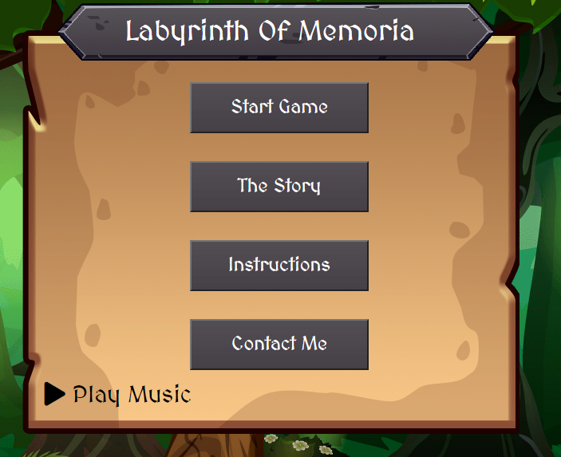
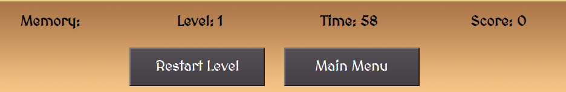
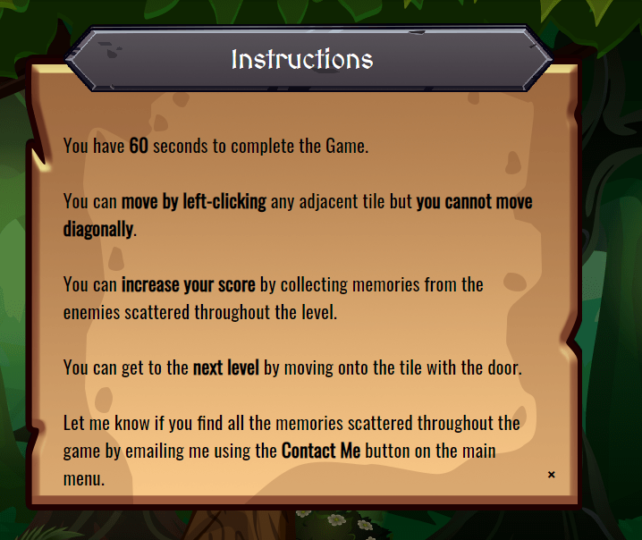
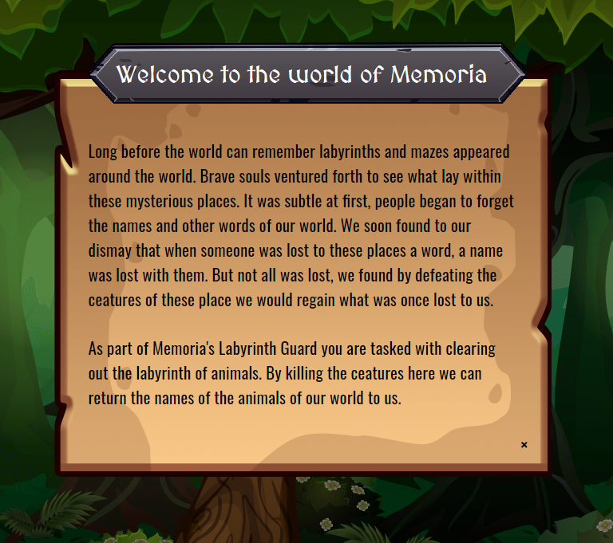
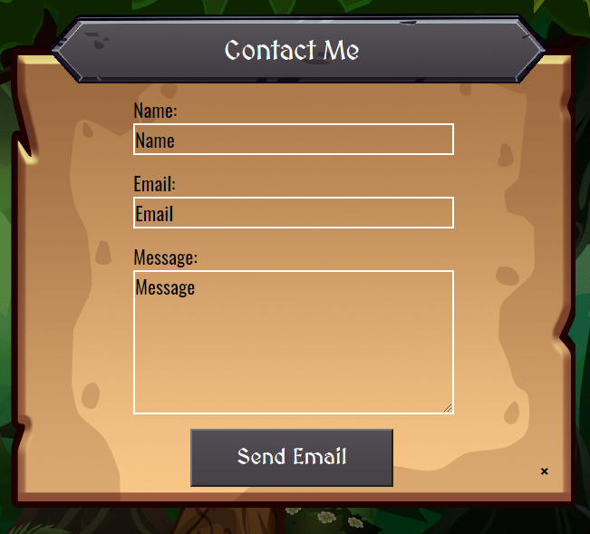
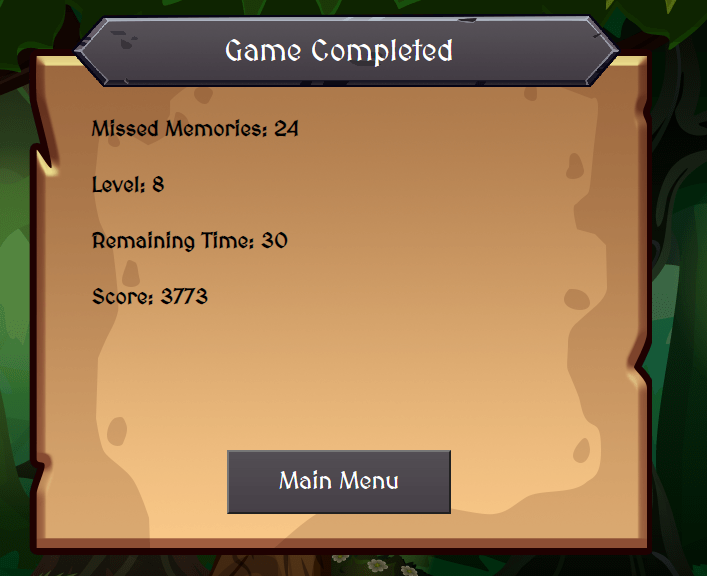
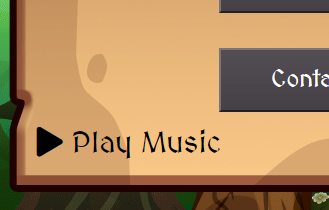

<h1 align="center">Testing</h1> 

## Code Validation
- #### HTML was validated using [validator.w3.org](https://validator.w3.org/). The validator gives a warning if you do not use h2-h6 in a section tag, the design of the site did not warrent the use of these tags so I have left these warning in the final version - The results can be found [index.html](images/home_page.png), [game.html](images/game_page.png).
- #### CSS was validated using [jigsaw.w3.org](https://jigsaw.w3.org/css-validator/) I did not have any errors in the validation - The results can be found [here](images/css.png).
- #### Chromes Developer Tool Lighthouse, this tool highlighted that I was missing the Meta description tag and keywords from my site so I have updated the pages to contain this - The desktop audit results can be found [index.html](PDF/desktop_index.pdf), [game.html](PDF/desktop_game.pdf). 
- #### JS was validated using [jshint.com](https://jshint.com/) For the audio JS I had 2 warnings based on the syntax of JS I was using - The results can be found [here](images/audio.png). For the menu JS I had 6 warnings based on the syntax of JS I was using - The results can be found [here](images/menu.png). For the sendemail JS I had 0 warnings - The results can be found [here](images/email.png). For the maingame JS I had 22 warnings based on the syntax of JS I was using - The results can be found [here](images/menu.png).

- #### Manual Testing was completed using Chrome, Edge, Firefox and Safari. Testing included the testing of all navigation links and the responsiveness of the site across these browsers. 

- #### Audio Testing was completed using Chrome, Edge, Firefox and Safari. The JS used to play the audio files will not work on IE 9 or below, I know of possible solutions for this but chose to not support IE browsers. 

## Testing the User Experience (UX) stories

-   #### First Time Visitor Goals
    1. As a First Time Visitor, I want to easily understand the main purpose of the site and learn more about the game.
    
    By viewing the menu items you can clearly see this site is for a game and you can find the Story and Instruction on how to play the game or contact the developer.

    2. As a First Time Visitor, I want to be able to easily navigate throughout the site and to contact the developer for more information.
    
    By using the buttons the user can clearly navigate the site and while they are on the game html the navigation can be found at the bottom of the screen.
    

    3. As a First Time Visitor, I want to be able to find out how the game works.
    
    By using the Instructions button the user can navigate to the Instructions modal and find out how the game works.
    

    4. As a First Time Visitor, I want to be able to easily find the story / lore of the game.
    
    By using the Story button the user can navigate to the Story modal and find out how the story of the game.
    

-   #### Returning Visitor Goals
    1. As a Returning Visitor, I want to find and play the game.
    
    By using the Start Game button the user can navigate to the game html and begin the game.

    2. As a Returning Visitor, I want to find the best / easiest way to get in contact with the delevoper.
    
    By using the Contact Me button the user can navigate to the Contact modal and by filling in the form can send the developer a message.
    

-   #### Frequent User Goals
    1. As a Returning Visitor, I want to complete the game from start to end.
    
    By using the Start Game button the user can start the game and complete each level until they game completed screen.
    

    2. As a Returning Visitor, I want to know all the memories that are in the game.
    
    By walking into all the enmeies on screen the player can see all the memories in the game using the Memory tag in the game status bar.

    3. As a Returning Visitor, I want to enable and disable sounds when needed.
    
    By using the Play Music icon the user can Play or pause the music.

    